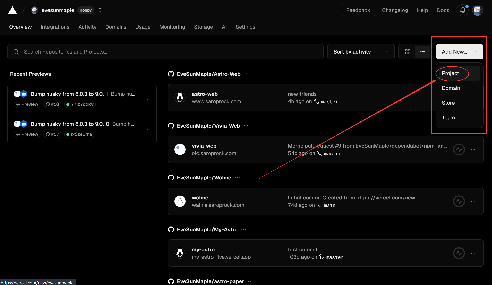
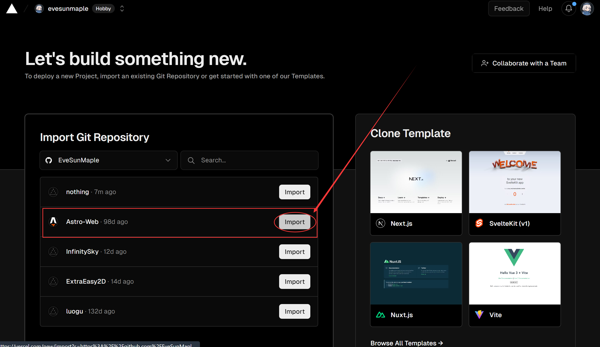
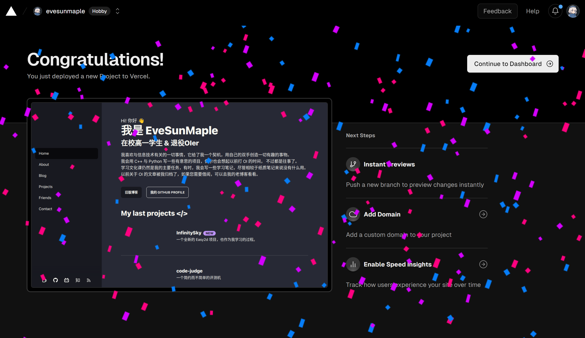

Astro 是集多功能于一体的 Web 框架,用于构建快速、以内容为中心的网站。 🎉 主要特性是以内容为中心，Astro 专为内容丰富的网站而设计。 服务器优先:网站在服务器上渲染 HTML 时运行速度更快。 默认快速:在 Astro 中构建缓慢的网站是不可能的。 易于使用:您不需要成为专家即可使用 Astro 构建某些内容。 功能齐全且灵活:超100多种 Astro 集成可供选择。

## Table of contents

## 需要的环境

* 为了让 Astro 在你的系统上运行，你需要安装 Node.js、版本 v18.14.1 或更高版本。
* [可选] 安装 pnpm：
```bash
npm install -g pnpm
```
* 一个 GitHub 账号
* 一个合适的代码编辑器
* 掌握一定的 魔法-Magic

## 创建你的博客项目

* Astro 不像 Hexo，可以安装多个主题，然后只用写几个配置文件就好了——还能随便切换主题。Astro 每个主题就是一个项目，而每位作者用的 frontmatter 格式可能都不一样，所以为了避免频繁迁移项目，请先选好自己要使用的主题。
* Astro 像 Hexo 一样，也有很多主题可用（更好的说法是项目模板）。你可以在 [Themes](https://astro.build/themes/) | [AstroPaper](https://github.com/satnaing/astro-paper) 挑选自己需要的主题，这里我选择简单好用的 AstroPaper 作为示例

## 拷贝主题 / 项目模板（仓库）

只需要使用包管理器即可（推荐使用 pnpm）：

```bash
# npm 6.x
npm create astro@latest --template satnaing/astro-paper
# npm 7+, extra double-dash is needed:
npm create astro@latest -- --template satnaing/astro-paper
# yarn
yarn create astro --template satnaing/astro-paper
```

完成后的目录如下：

```
/
├── public/
│   ├── assets/
│   │   └── logo.svg
│   │   └── logo.png
│   └── favicon.svg
│   └── astropaper-og.jpg
│   └── robots.txt
│   └── toggle-theme.js
├── src/
│   ├── assets/
│   │   └── socialIcons.ts
│   ├── components/
│   ├── content/
│   │   |  blog/
│   │   |    └── some-blog-posts.md
│   │   └── config.ts
│   ├── layouts/
│   └── pages/
│   └── styles/
│   └── utils/
│   └── config.ts
│   └── types.ts
└── package.json
```
安装必要的内容：

```bash
npm install
```

如果你迫不及待想看看自己的博客，可以启动 Astro 开发服务：

```bash
npm run dev
```

你应该能在终端中看到 Astro 正在以开发模式运行的提示信息。

在浏览器中输入 http://localhost:4321/ 即可即时预览。


## 个性化你的博客

config.ts  
里面包含了网站的一些基本信息，下面是 AstroPaper 的 config.ts

```js
// file: src/config.ts
export const SITE = {
  website: "https://astro-paper.pages.dev/",
  author: "Sat Naing",
  desc: "A minimal, responsive and SEO-friendly Astro blog theme.",
  title: "AstroPaper",
  ogImage: "astropaper-og.jpg",
  lightAndDarkMode: true,
  postPerPage: 3,
  scheduledPostMargin: 15 * 60 * 1000, // 15 minutes
};
```
| 选项               | 描述                                                                                                                                                                                                                                         |
| --------------------- | --------------------------------------------------------------------------------------------------------------------------------------------------------------------------------------------------------------------------------------------------- |
| website            | 您部署的网站URL                                                                                                                                                                                                                         |
| author             | 您的姓名                                                                                                                                                                                                                                         |
| desc                | 您的网站描述。对于SEO和社交媒体分享很有用                                                                                                                                                                                    |
| title               | 您的网站名称                                                                                                                                                                                                                                  |
| ogImage             | 您网站的默认OG图像。对于社交媒体分享很有用。OG图像可以是外部图像URL，也可以放置在/public目录下                                                                                     |
| lightAndDarkMode    | 启用或禁用网站的明亮和暗黑模式。如果禁用，将使用主色彩方案。此选项默认启用。                                                                                                         |
| postPerPage         | 	您可以指定每个帖子页面上显示多少帖子。（例如：如果将SITE.postPerPage设置为3，则每页只显示3篇帖子）                                                                                            |
| scheduledPostMargin | 在生产模式下，具有将来pubDatetime的帖子将不可见。但是，如果帖子的pubDatetime在接下来的15分钟内，它将是可见的。如果您不喜欢默认的15分钟间隔，可以设置scheduledPostMargin|

#### 新文章

blog/ 文件夹中放的就是你的文章，用一般的 MarkDown 格式编写即可，注意里面的 frontmatter，不同的主题可能有不同的 frontmatter 规则，详见主题仓库的 README.md。

下面是 AstroPaper 的 frontmatter 规则：

| 属性               | 描述                   | 备注                                                                                                                                                                                              
|-----|-----|-----|
| title | 文章的标题 (h1) | 必填*
| description | 文章的描述。用于文章摘要和文章的站点描述 | 必填*
| pubDatetime | 发布的日期时间，使用 ISO 8601 格式 | 必填*
| modDatetime | 修改的日期时间，使用 ISO 8601 格式。 （仅在博客文章修改时添加此属性）| 可选
| author | 文章的作者| 默认 = SITE.author
| slug | 文章的Slug。此字段是可选的，但不能是空字符串。 (slug: ""❌) | 默认 = slugified文件名
| featured | 是否在首页的特色部分显示此文章| 默认 = false
| draft | 将此文章标记为’未发布’ | 	默认 = false
| tags | 此文章的相关关键词。以数组 yaml 格式编写 | 默认 = others
| ogImage | 文章的OG图像。对于社交媒体分享和SEO很有用| 默认 = SITE.ogImage 或生成的OG图像
| canonicalURL | 规范的URL（绝对路径），以防文章已经存在于其他来源。 | 默认 = Astro.site + Astro.url.pathname


## 部署你的博客项目

随便找一个托管平台部署即可，这里使用 Vercel 。

#### 将你的项目托管至 GitHub

这个不用多说了吧：

```bash 
git init
git add README.md
git commit -m "first commit"
git branch -M main
git remote add origin 你的仓库地址
git push -u origin main
```

#### 托管 Vercel

- 进入 Vercel 然后注册一个账号；
- 新建一个项目；

- 选择你刚刚创建的仓库;

- 点击 Deploy;
- 看到满屏的烟花了吗？你成功了！



## 总结


这是如何用 Astro 搭建一个高性能博客的简要说明。如果你知道一些编码，你可以自定义更多。要定制样式，请阅读[本文](https://astro-paper.pages.dev/posts/customizing-astropaper-theme-color-schemes/). 感谢阅读✌🏻