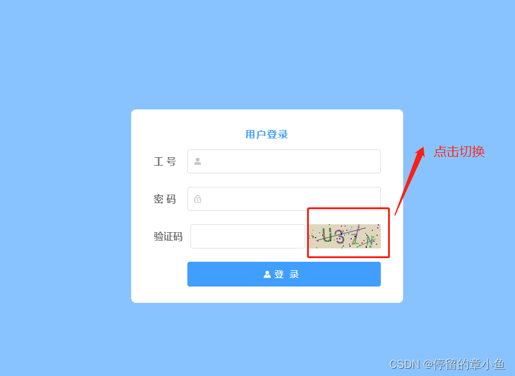

动态验证码是一种在前端界面动态生成并显示的验证码，通常用于验证用户输入的有效性，特别是在需要防止恶意攻击或机器人自动提交的场景下。与传统的静态验证码不同，动态验证码每次刷新页面或点击刷新按钮时都会重新生成，增加了验证码的复杂度和安全性。

##   目录
- [目录](#目录)
- [基础知识概述](#基础知识概述)
- [准备工作](#准备工作)
- [创建 securityCode.vue 组件](#创建-securitycodevue-组件)
- [父组件中使用](#父组件中使用)
- [完整代码](#完整代码)
  - [子组件](#子组件)
  - [父组件](#父组件)
- [效果图展示](#效果图展示)
- [总结](#总结)


## 基础知识概述

在深入代码之前，请确保你对以下知识点有基本的了解：

- `HTML` 和 `CSS`
- `JavaScript` 基础（包括 ES6 语法）
- 基本的`Vue.js`概念，如组件、响应式系统、生命周期钩子等
- 绘图API `Canvas`

## 准备工作

在开始之前，确保你的电脑中有已经创建好的 vue2 项目。如果没有，你可以通过以下命令进行创建项目：

```bash
# 全局安装脚手架
npm install -g @vue/cli

# 创建项目
vue create my-project

```

## 创建 securityCode.vue 组件
首先，我们需要创建一个名为`securityCode.vue`的 Vue 组件，此组件负责生成和显示验证码。

- 组件结构  

组件包括一个`<canvas>`元素，用于动态绘制验证码图像。

```vue
<template>
	<canvas id="s-canvas" :width="contentWidth" :height="contentHeight"></canvas>
</template>
```

- 组件属性  

定义接受的属性与其默认值，包括验证码内容、字体大小范围、颜色设置等。

```vue
<script>
export default {
		name: "securityCode",
		props: {
			identifyCode: {
				type: String,
				default: "",
			},
			fontSizeMin: {
				type: Number,
				default: 22,
			},
			fontSizeMax: {
				type: Number,
				default: 40,
			},
			backgroundColorMin: {
				type: Number,
				default: 180,
			},
			backgroundColorMax: {
				type: Number,
				default: 240,
			},
			colorMin: {
				type: Number,
				default: 50,
			},
			colorMax: {
				type: Number,
				default: 160,
			},
			lineColorMin: {
				type: Number,
				default: 40,
			},
			lineColorMax: {
				type: Number,
				default: 180,
			},
			dotColorMin: {
				type: Number,
				default: 0,
			},
			dotColorMax: {
				type: Number,
				default: 255,
			},
			contentWidth: {
				type: Number,
				default: 120,
			},
			contentHeight: {
				type: Number,
				default: 40,
			},
		},
}
</script>
```
组件方法  

实现随机数生成、随机颜色生成及验证码的绘制。

```javascript
	methods: {
		randomNum(min, max) {
			return Math.floor(Math.random() * (max - min) + min);
		},
		randomColor(min, max) {
			let r = this.randomNum(min, max);
			let g = this.randomNum(min, max);
			let b = this.randomNum(min, max);
			return "rgb(" + r + "," + g + "," + b + ")";
		},
		drawPic() {
			// 绘制方法实现略
		},
	},
```

- 生命周期和监听器  

当组件加载或验证码变更时，调用`drawPic`方法，自动触发绘制。

```javascript
	watch: {
		identifyCode() {
			this.drawPic();
		},
	},
	mounted() {
		this.drawPic();
	},
};
```

## 父组件中使用

- 引入和注册  

在登录页面的 Vue 文件中，引入并注册`securityCode`组件。

```vue
<script>
import SecurityCode from "@/components/securityCode";
export default {
	components: {
		SecurityCode
	},
	// 数据和方法略
}
</script>
```


- 页面布局  

在登录表单中添加验证码组件的使用代码。

```javascript

<el-form-item prop="pass" label="验证码" class="row" label-width="150px">
	<div class="row space-between" style="width: 315px;">
		<el-input type="text" style="width: 190px;" v-model="inputCode" autocomplete="off"></el-input>
		<div @click="refreshCode()" style="line-height: 0;">
			<!-- 验证码组件 -->
			<SecurityCode :identifyCode="identifyCode"></SecurityCode>
		</div>
	</div>
</el-form-item>

```

- 方法实现  
  
实现刷新和生成验证码的方法，以及提交表单时的验证逻辑。

```javascript
methods: {
	refreshCode() {
		this.inputCode = '';
		this.identifyCode = "";
		this.makeCode(4);
	},
	makeCode(length) {
		// 生成验证码逻辑略
	},
	submitForm(formName) {
		// 表单提交逻辑略
	},
}
```

## 完整代码
 
### 子组件

```vue
<template>
	<canvas id="s-canvas" :width="contentWidth" :height="contentHeight"></canvas>
</template>
<script>
	export default {
		name: "securityCode",
		props: {
			identifyCode: {
				type: String,
				default: "",
			},
			fontSizeMin: {
				type: Number,
				default: 22,
			},
			fontSizeMax: {
				type: Number,
				default: 40,
			},
			backgroundColorMin: {
				type: Number,
				default: 180,
			},
			backgroundColorMax: {
				type: Number,
				default: 240,
			},
			colorMin: {
				type: Number,
				default: 50,
			},
			colorMax: {
				type: Number,
				default: 160,
			},
			lineColorMin: {
				type: Number,
				default: 40,
			},
			lineColorMax: {
				type: Number,
				default: 180,
			},
			dotColorMin: {
				type: Number,
				default: 0,
			},
			dotColorMax: {
				type: Number,
				default: 255,
			},
			contentWidth: {
				type: Number,
				default: 120,
			},
			contentHeight: {
				type: Number,
				default: 40,
			},
		},
		methods: {
			// 生成一个随机数
			randomNum(min, max) {
				return Math.floor(Math.random() * (max - min) + min);
			},
			// 生成一个随机的颜色
			randomColor(min, max) {
				let r = this.randomNum(min, max);
				let g = this.randomNum(min, max);
				let b = this.randomNum(min, max);
				return "rgb(" + r + "," + g + "," + b + ")";
			},
			drawPic() {
				let canvas = document.getElementById("s-canvas");
				let ctx = canvas.getContext("2d");
				ctx.textBaseline = "bottom";
				// 绘制背景
				ctx.fillStyle = this.randomColor(
					this.backgroundColorMin,
					this.backgroundColorMax
				);
				ctx.fillRect(0, 0, this.contentWidth, this.contentHeight);
				// 绘制文字
				for (let i = 0; i < this.identifyCode.length; i++) {
					this.drawText(ctx, this.identifyCode[i], i);
				}
				this.drawLine(ctx);
				this.drawDot(ctx);
			},
			drawText(ctx, txt, i) {
				ctx.fillStyle = this.randomColor(this.colorMin, this.colorMax);
				ctx.font =
					this.randomNum(this.fontSizeMin, this.fontSizeMax) + "px SimHei";
				let x = (i + 1) * (this.contentWidth / (this.identifyCode.length + 1));
				let y = this.randomNum(this.fontSizeMax, this.contentHeight - 5);
				var deg = this.randomNum(-45, 45);
				// 修改坐标原点和旋转角度
				ctx.translate(x, y);
				ctx.rotate((deg * Math.PI) / 330);
				ctx.fillText(txt, 0, 0);
				// 恢复坐标原点和旋转角度
				ctx.rotate((-deg * Math.PI) / 330);
				ctx.translate(-x, -y);
			},
			drawLine(ctx) {
				// 绘制干扰线
				for (let i = 0; i < 3; i++) {
					ctx.strokeStyle = this.randomColor(
						this.lineColorMin,
						this.lineColorMax
					);
					ctx.beginPath();
					ctx.moveTo(
						this.randomNum(0, this.contentWidth),
						this.randomNum(0, this.contentHeight)
					);
					ctx.lineTo(
						this.randomNum(0, this.contentWidth),
						this.randomNum(0, this.contentHeight)
					);
					ctx.stroke();
				}
			},
			drawDot(ctx) {
				// 绘制干扰点
				for (let i = 0; i < 80; i++) {
					ctx.fillStyle = this.randomColor(0, 255);
					ctx.beginPath();
					ctx.arc(
						this.randomNum(0, this.contentWidth),
						this.randomNum(0, this.contentHeight),
						1,
						0,
						2 * Math.PI
					);
					ctx.fill();
				}
			},
		},
		watch: {
			identifyCode() {
				this.drawPic();
			},
		},
		mounted() {
			this.drawPic();
		},
	};
</script>
```

### 父组件

```vue
<el-form-item prop="pass" label="验证码" class="row" label-width="150px">
	<div class="row space-between" style="width: 315px;">
		<el-input type="text" style="width: 190px;" v-model="inputCode" autocomplete="off"></el-input>
		<div @click="refreshCode()" style="line-height: 0;">
			<!--验证码组件-->
			<SecurityCode :identifyCode="identifyCode"></SecurityCode>
		</div>
	</div>
</el-form-item>
<el-form-item style="padding-left: 55px;">
	<el-button type="primary" @click="submitForm()" icon="el-icon-s-custom">
		<span style="font-size: 15px;letter-spacing: 10px;">登录</span>
	</el-button>
</el-form-item>
<script>
	//导入组件
	import SecurityCode from "@/components/securityCode";
	export default {
		components: {//注册
			SecurityCode
		},
    data() {
      identifyCode: "",//随机组合字符串
			inputCode: "", //text框输入的验证码
      },
     mounted() {
			this.refreshCode();
		},
    methods: {
			//初始化验证码
			refreshCode() {
				this.inputCode = ''
				this.identifyCode = ""; //输入框置空
				this.makeCode(4); //验证码长度为4
			},
			//随机切换验证码
			makeCode(length) {
				let code = '';
				for (let i = 0; i < length; i++) {
					const r = Math.floor(Math.random() * 36);
					if (r < 10) {
						code += r;
					} else {
						code += String.fromCharCode(r - 10 + 65);
					}
				}
				this.identifyCode = code
				localStorage.setItem('code', code);
				console.log(this.identifyCode);
			},
      submitForm() {
				const code = this.inputCode.toLowerCase();
				const originalCode = localStorage.getItem('code').toLowerCase();
				if (!code) {
					this.$message.error('请输入验证码！');
					return
				} else if (code !== originalCode) {
					this.$message.error('验证码输入错误！');
					this.refreshCode()
					return
				}
			
        }
    }
</script>
```

## 效果图展示




## 总结  

通过构建一个 Vue 组件实现了验证码的动态生成与验证功能，增强了用户表单的安全性。此验证码组件不仅可用于登录表单，还可以扩展到其他需要验证码验证的场景。 感谢阅读✌🏻