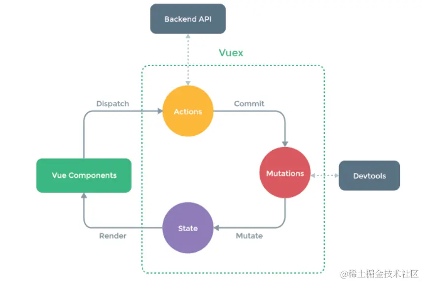

## Table of contents
- [Table of contents](#table-of-contents)
- [介绍](#介绍)
  - [什么是 Store](#什么是-store)
  - [Vuex](#vuex)
  - [Pinia](#pinia)
- [安装](#安装)
- [创建与使用](#创建与使用)
  - [vuex](#vuex-1)
  - [Pinia](#pinia-1)
- [修改状态](#修改状态)
  - [Vuex](#vuex-2)
  - [vuex的数据流程](#vuex的数据流程)
    - [简单概述](#简单概述)
  - [Pinia](#pinia-2)
- [重置 state](#重置-state)
- [模块化](#模块化)
  - [Vuex](#vuex-3)
  - [Pinia](#pinia-3)
- [最后](#最后)

## 介绍

 
### 什么是 Store 
`Store`是一个保存状态和业务逻辑的实体，它并不与你的组件树绑定。换句话说，它承载着全局状态。它有点像一个永远存在的组件，每个组件都可以读取和写入它。
### Vuex
`Vuex`就是一个专为 Vue 应用程序开发的`Store`。它用于管理 Vue 应用中的共享状态，使得多个组件能够方便地访问和修改相同的数据。`Vuex`的核心概念包含`state`、`mutations`、`actions`和`getters`等。
### Pinia
`Pinia`是一个专为 Vue 3 设计的`Store`。它是在 Vue 3 响应式 API 的基础上构建的，旨在提供一种轻量、灵活且直观的状态管理解决方案。与传统的`Vuex`不同，`Pinia`不依赖于全局对象，而是通过创建独立的`store`实例来管理状态。`state`、`getter`和`action`是`Pinia`的三个重要概念。
 

## 安装

- vuex
  
```bash
yarn add vuex@next --save
# 或者使用 npm
npm install vuex@next --save
```
- pinia

```bash
yarn add pinia
# 或者使用 npm
npm install pinia
```

注意：实际项目开发可不要即用`Vuex`又用`Pinia`，除非公司是你家开的。


## 创建与使用

### vuex

- 在自己项目的`src`目录下创建一个`store`目录，再创建一个`index.js`，在这里我们创建 Vuex 的`store`实例。

```js
import { createStore } from 'vuex'

const store = createStore({
    //需要管理的数据存放在这里
    state() {
        return {
            msg: "hello vuex",
        };
    },

    //唯一可以同步修改state的地方
    mutations: {
    },

    //异步修改state,本质还是通过mutations修改
    actions: {
    },

    //类似于vue中的计算属性computed
    getters: {
    },

    //如果需要vuex管理的数据多的话，可以拆分为一个个模块
    modules: {
    }
})

export default store;

```

- 在`main.js`中引入刚刚创建的实例`store`

```js
import { createApp } from 'vue'
import App from './App.vue'
import store from './store'

createApp(App).use(store).mount('#app')
```

- 在App.vue中使用：

```js
<template>
  <div>
     {{store.state.msg}}
  </div>
</template>

<script setup>
import { useStore } from 'vuex'
let store = useStore()
</script>

```
如果页面成功显示`hello vuex`，恭喜你，已经成功创建了一个Vuex Store实例。


### Pinia

- 同理，在`src`目录下创建一个`store`目录，在`index.js`中创建 Pinia 的store实例：

```js
import { defineStore  } from 'pinia'

export const store = defineStore('store',{
    state: ()=>{
        return {
            msg:'hello pinia',
        }
    },
    getters: {},
    actions: {}
})

```
- 在`main.js`中引入创建的 Pinia 实例：

```js
import { createApp } from 'vue'
import App from './App.vue'
import { createPinia } from 'pinia'
const pinia = createPinia()

createApp(App).use(pinia).mount('#app')

```

- 在`App.vue`中使用：

```js
<template>
  <div>
     {{storeA.msg}}
  </div>
</template>

<script setup>
import { store } from './store';
let storeA = store()
</script>

```

如果页面成功显示`hello pinia`，恭喜你 Pinia 实例创建成功~

## 修改状态

### Vuex

- 在组件中直接修改

```js
<template>
  <div>
    {{store.state.msg}}
  </div>
</template>

<script setup>
import { useStore } from 'vuex'
let store = useStore()
store.state.msg = 'hello juejin' //直接赋值修改
</script>

```

方法可行，但是这样直接修改状态会绕过 Vuex 的`mutation`操作，破坏了单向数据流的概念。Vuex 还是推荐通过`mutations`来修改状态，以确保状态的变化是可追踪的。

- 在mutations中修改

```js
import { createStore } from 'vuex'

const store = createStore({
    //需要管理的数据存放在这里
    state() {
        return {
            msg: "hello vuex",
        };
    },

    //唯一可以同步修改state的地方
    mutations: {
        changeMsg(state,data){
            state.msg = data
        }
    },
    ......
})

export default store;

```

- 在组件中用commit触发状态变更：

```js

<template>
  <div>
    {{store.state.msg}}
  </div>
</template>

<script setup>
import { useStore } from 'vuex'
let store = useStore()
store.commit('changeMsg','hello juejin')//commit触发状态变更
</script>

```

- 在actions中进行提交mutations进行修改

```js
import { createStore } from 'vuex'

const store = createStore({
    state() {
        return {
            msg: "hello vuex",
        };
    },

    mutations: {
        changeMsg(state, data) {
            state.msg = data
        }
    },

    //异步通过mutations修改state
    actions: {
        async getMsg({ commit }, newMsg) {
            setTimeout(() => {
                commit('changeMsg', newMsg);
            }, 1000);
        }
    },
    ......
})

export default store;

```

- 在组件中使用dispatch进行分发actions

```js

<template>
  <div>
    {{store.state.msg}}
  </div>
</template>

<script setup>
import { useStore } from 'vuex'
let store = useStore()
store.dispatch('getMsg','hello juejin')  //dispatch分发
</script>

```
这里我们在`actions`中设置了一个一秒的定时器，来模拟异步操作，使用一进入页面，显示的还是`hello vuex`，但一秒后就变成`hello juejin`了。


### vuex的数据流程

#### 简单概述

就是组件通过调用`dispatch`触发一个`Action`，`Action`的处理函数执行一些异步操作，然后提交一个`Mutation`，`Mutation`的处理函数修改`State`，`State`的变化触发视图的更新。



### Pinia

- 在组件中直接修改

```js
<template>
  <div>
    {{storeA.msg}}
  </div>
</template>

<script setup>
import { store } from './store';
let storeA = store()
storeA.msg = 'hello juejin'
console.log(storeA.msg);
</script>

```

- 使用$patch方法

使用`$patch`方法可以修改一个或多个状态

```js
import { defineStore  } from 'pinia'

export const store = defineStore('store',{
    state: ()=>{
        return {
            msg:'hello pinia',
            name:'yangyangyang'
        }
    },
    getters: {},
    actions: {}
})

```

- 在组件中进行修改


```js
<template>
  <div>
    {{storeA.msg}}
  </div>
</template>

<script setup>
import { store } from './store';
let storeA = store()
console.log(storeA.msg,storeA.name);
storeA.$patch({
  msg:'hello juejin',
  name:'miemiemie'
})
console.log(storeA.msg,storeA.name);
</script>

```

- 在actions中进行修改

- 与 Vuex 的`actions`不同，Pinia中的`actions`既可以是同步也可以是异步，由于 Pinia 中没有`mutations`，所以工作都交给了`actions`。

```js
import { defineStore  } from 'pinia'

export const store = defineStore('store',{
    state: ()=>{
        return {
            msg:'hello pinia',
            name:'yangyangyang'
        }
    },
    actions: {
        changeMsg(data){
            this.msg = data
        }
    },
    getters: {},
})

```

- 直接在组件中调用`changeMsg`方法，而不用像 Vuex 一样`dispatch`进行分发。


```js

<template>
  <div>
    {{storeA.msg}}
  </div>
</template>

<script setup>
import { store } from './store';
let storeA = store()
storeA.changeMsg('hello juejin')
</script>

```

## 重置 state

- 使用选项式 API时，可以通过调用 store 的`$reset()` 方法将 state 重置为初始值。

```js
<script setup>
import { store } from './store';
let storeA = store()
storeA.changeMsg('hello juejin')
console.log(storeA.msg);
storeA.$reset()
console.log(storeA.msg);
</script>

```

##  模块化

由于使用单一状态树，应用的所有状态会集中到一个比较大的对象。当应用变得非常复杂时，store 对象就有可能变得相当臃肿。为了解决以上问题，对 Vuex 或 Pinia 进行模块化开发至关重要，尤其是对于大型项目。

### Vuex

Vuex 允许我们将 Store 拆分成多个模块（module），每个模块都有自己的
`State`、`Mutation`、`Action`和`Getter`。

一般项目开发中，我们都会将每个`module`单独存放在一个文件中，然后再引入总入口`store/index.js`中

- 在`src`目录下创建一个`modules`文件夹，然后在其中创建你的模块文件。

- 模块A
```js
//modules/moduleA.js
const moduleA = {
  state: () => ({ 
     msg:'hello moduleA'
  }),
  mutations: {},
  actions: {},
  getters: {}
}
export default moduleA

```

- 模块B

```js
//modules/moduleB.js
const moduleB = {
  state: () => ({ 
     msg:'hello moduleB'
  }),
  mutations: {},
  actions: {},
  getters: {}
}
export default moduleB

```

- 将各模块引入主模块

```js
//store/index.js
import { createStore } from 'vuex';
import moduleA from '../modules/moduleA';
import moduleB from '../modules/moduleB';
const store = createStore({
  modules: {
    moduleA,
    moduleB
  }
})
export default store;

```

- 在组件中使用moduleA和moduleB

```js
<template>
  <div>
    {{store.state.moduleA.msg}}
    <br>
    {{store.state.moduleB.msg}}
  </div>
</template>

<script setup>
import { useStore } from 'vuex'
let store = useStore()
</script>

```
为了防止各模块中`mutations`或者`actions`中的方法重名引发的问题，`modules`提供了命名空间 的方法（namespaced: true）

- 以moduleA为例：

```js
//modules/moduleA.js
const moduleA = {
    namespaced: true,
    state: () => ({ 
       msg:'hello moduleA'
    }),
    mutations: {
       changeMsg(state,data){
          state.msg = data
       }
    },
    actions: {},
    getters: {}
  }
export default moduleA

```

- 为了避免其他模块中也有相同命名的`changeMsg`方法，我们可以通过 “模块名/方法名” 的方式调用。

```js

import { useStore } from 'vuex'
let store = useStore()
console.log(store.state.moduleA.msg);
store.commit('moduleA/changeMsg','hello juejin')
console.log(store.state.moduleA.msg);

```

### Pinia

Pinia 每个状态库本身就是一个模块。Pinia 没有`modules`，如果想使用多个`Store`，直接定义多个 `Store`传入不同的 ID （defineStore()的第一个参数）即可。

```js
import { defineStore  } from 'pinia'

export const useModuleA = defineStore('storeA',{
  state: () => (),
  actions: {},
  getters: {}
});

export const useModuleB = defineStore('storeB',{
  state: () => (),
  actions: {},
  getters: {}
});

```

- 在组件中，要使用哪个模块就引入哪个模块。


```js

import { useModuleA } from './store';
let storeA = useModuleA()
console.log(storeA.msg);
storeA.changeMsg('hello juejin')
console.log(storeA.msg);

```

## 最后

如果你的项目是基于 Vue 2，可以选择 Vuex，如果你的项目基于 Vue 3，喜欢使用组合式 API，使用 TS ，那么更推荐使用 Pinia。当然，具体根据个人和团队的具体情况来选择。感谢阅读✌🏻